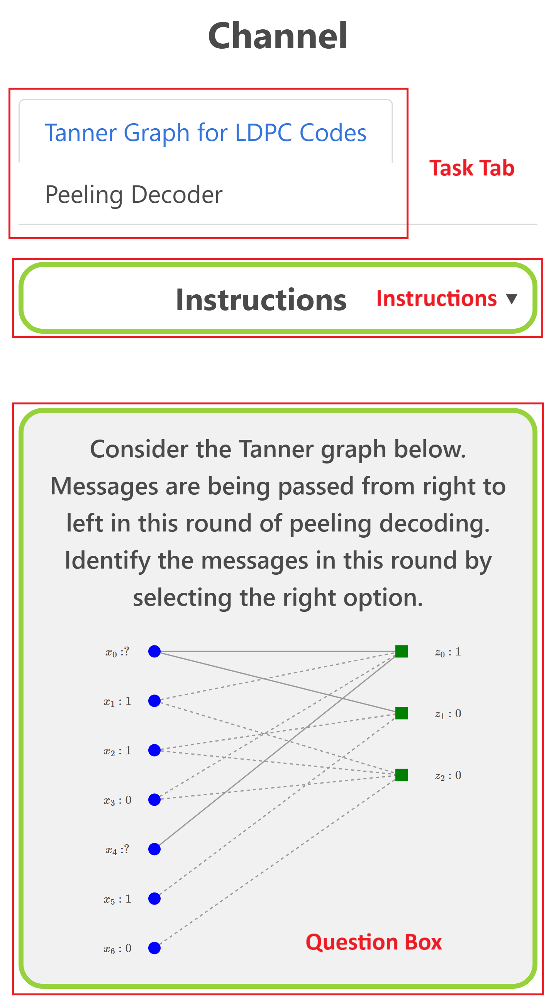
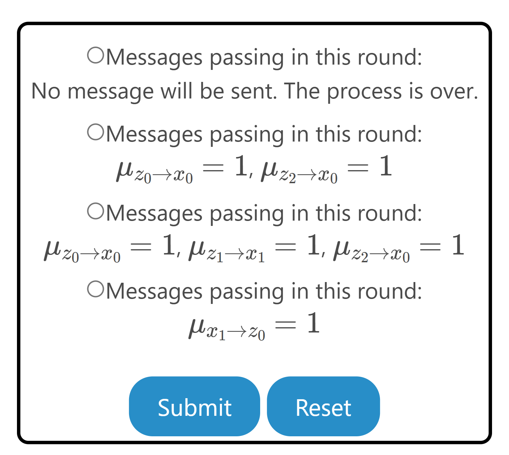
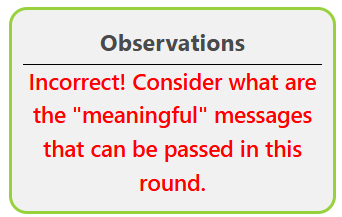
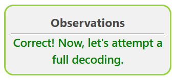
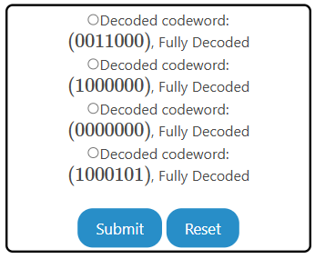

The experiment consists of two tasks. The user is recommended to go through these in the same sequence as they are presented. 

1. Tanner Graph for LDPC Codes
    * Given a Tanner graph, learn how to pass messages between variable and check nodes.
1. Peeling Decoder for LDPC Codes
    * For given Tanner graph, learn how to decode the received vector using the peeling decoder.    

## Overview of the Experiment window

    
    
    

The experiment window consists of the following components:
1. **Task tab**: The task tab contains the list of tasks that need to be performed in the experiment. The user can navigate to any task by clicking on the corresponding task in the task tab.
2. **Instruction box**: The instruction box displays step-by-step instructions to perform the task.
3. **Question box**: The question box displays the question to be answered by the user.
4. **Observation box**: The observation box displays the feedback messages based on the user's input.
5. **Action box**: The action box contains the input elements and buttons to perform the task.

## Experiment: 

There are two tasks in this experiment.

### Task 1: Tanner Graph for LDPC Codes

1. **Select message**: Select the option corresponding to the correct message(s) passed in this round of peeling decoding
for the given Tanner graph.
    
  

2. **Verify the Message**: Verify the correctness of the message(s) passed in this round of peeling decoding.  
    - Click on <strong>Submit</strong> to verify the correctness of the message(s) passed in this round of peeling decoding. 
    - The observation box will display the feedback message accordingly.  
      
 
      
      
      

3. **Reset**: Click on **Reset** to reset the experiment and start again.
    
  
 
    - Click on <strong>Reset</strong> to reset the experiment and start again.  
      

### Task 2: Peeling Decoder for LDPC Codes

1. **Select Decoded Codeword**: Select the option corresponding to the correct decoded codeword for the given Tanner graph.  
    
 
 
    - Select the option corresponding to the correct decoded codeword for the given Tanner graph.  

2. **Reset**: Click on **Reset** to reset the experiment and start again.
    
 
 
    - Click on <strong>Reset</strong> to reset the experiment and start again.  