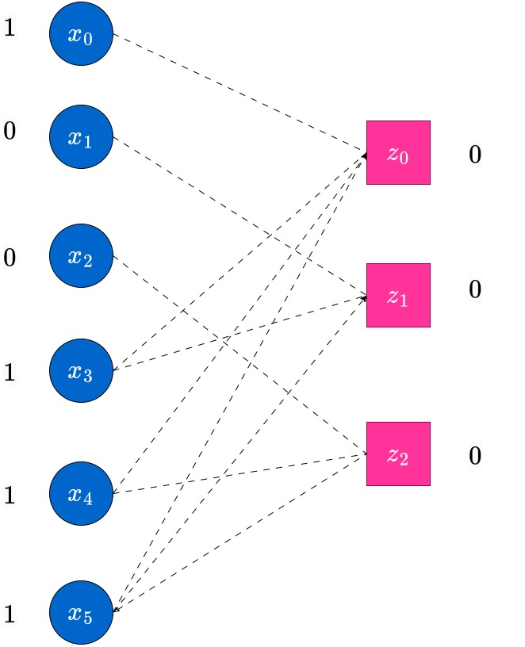

We describe the message passing algorithm for achieving Bit-wise Maximum Aposterior Probability Decoding of linear codes on erasure channels. 

In the experiment titled 'Maximum Likelihood (ML) Decoding of Codes on Binary Input Channels', we observed that the block-MAP estimate had a similar expression, except that we were focussed on decoding the estimating the entire transmitted codeword (or the entire 'block') according to the maximum-aposteriori probability expression for the whole codeword given the received vector $\bm{y}$. However, in this and the subsequent experiments regarding decoding of LDPC codes, we will do *bit-wise MAP decoding**.

Let $\bm{x}=(x_0,\ldots,x_{n-1})\in {\cal C}$ be the codeword transmitted from the linear code $\cal C$ of dimension $k$. Let $\bm{y}=(y_0,\ldots,y_{n-1})$ be the received vector from the channel. The bit-wise MAP estimate of the bit $x_i$ is based on the value of the log-likelihood ratio (LLR) of $x_i$ given $\bm{y}$, denoted by $L(x_i|\bm{y})$, and  defined as follows. 

$$L(x_i)\triangleq \log\left(\frac{p(x_i=0|\bm{y})}{p(x_i=1|\bm{y})}\right).$$

<!-- In the case of erasure channels, we assume without loss of generality that $x_i\in\{+1,-1}$, under a bipolar signalling scheme. Thus, the LLR $L(x_i)$ is then defined as  -->
<!-- $$L(x_i)\triangleq \log\left(\frac{p(x_i=+1|\bm{y})}{p(x_i=-1|\bm{y})\right)$$. -->

The bitwise MAP estimate for $x_i$ is then denoted by $\hat{x}_i$ and calculated as follows. 
$$\begin{align}
\hat{x}_i=\begin{cases}0,& \text{if}~L(x_i)>0\\
1, & \text{if}~L(x_i)<0.
\end{cases}
\end{align}
$$
Note that we assume ties are broken arbitrarily, i.e., the decoder choose the estimate $\hat{x}_i$ randomly if $L(x_i|\bm{y})=0$. 

With this assumption in mind, we describe a decoding technique based on a general class of algorithms on graphs, which are known as message passing algorithms. Essentially, we run a number of rounds of passing messages from the variable nodes of the Tanner graphs to the check nodes and vice-versa. These rounds, when they complete, lead to two possibilities at which the algorithm is terminated. The first possibility is that we end with a fully decoded codeword estimate, which is also correct. The second possibility is that we end up with a partially decoded estimate, which is correct only in the decoded bits, but may have some erased coordinates which cannot be decoded by any algorithm. 

In other words, this iterative procedure of message passing implements the bit-wise MAP decoding algorithm in an efficient manner, for all LDPC codes. 

Before describing the algorithm, we give a short note on the motivation for this algorithm. 

### The connection between the bit-wise MAP algorithm and identifying compatible codeword(s)

Observe that, in the erasure channel, for a transmitted codeword $\bm{x}=(x_0,\dots,x_{n-1})$ the received vector $\bm{y}=(y_0,\dots,y_{n-1})$ is such that $y_i=x_i$ or $y_i=?$, for all $i\in\{0,\dots,n-1\}$. The goal in decoding therefore is to reconstruct the erased symbols, as the non-erased symbols in $\bm{y}$ and $\bm{x}$ are identical. 

It is not difficult to see that if the bit-wise MAP decoding estimate for the $i^{th}$ bit of the codeword, denoted by $\hat{x}_i$ is be exactly the correct bit $x_i$ in the transmitted codeword, then among all codewords $\bm{c}\in{\cal C}$ which are compatible with the received vector $\bm{y}$ (i.e., those codewords which match $\bm{y}$ in all unerased positions), the $i^{th}$ co-ordinate $c_i$ is same. 

Since this must be true for all the unerased bits, it must be the case that there must be exactly one codeword, which must be the exact transmitted codeword in ${\cal C}$, if the bit-wise MAP estimate is indeed correct. 

Now, if there is no such unique codeword, then, the bit-wise MAP decoder is surely unable to identify the exact codeword transmitted, in such a scenario. Thus, in this case, we cannot estimate all the codeword bits uniquely. We will have to decode only those bits which are identical in all codewords compatible to $\bm{y}$. The other coordinates may not be possible to be identified uniquely.

With these ideas in mind, we are now ready to describe the working of the message-passing algorithm. 

### Message Passing on the Tanner Graph for Erasure Channels 

Consider the code with the parity check $H$ matrix given as follows. 

$$H=\begin{bmatrix}1&0&0&1&1&1\\
0&1&0&1&0&1\\
0&0&1&0&1&1
\end{bmatrix}.$$

Observe that any two columns of this matrix are linearly independent, so this code is capable of correcting any erasure pattern with upto two erasures. In fact, some patterns with upto three erasures can also get corrected by a block-wise MAP decoder. But here, we will focus on at most two erasures. Further, the generator matrix of this code can be obtained as 
%%%%
$$G=\begin{bmatrix}1&1&0&1&0&0\\
1&0&1&0&1&0\\
1&1&1&0&0&1\end{bmatrix}.$$

Clearly, this code has $8$ codewords. Assume that the codeword transmitted is $\bm{x}=(1,0,0,1,1,1)$. Let the received vector be $\bm{y}=(1,0,0,?,?,?)$. We see that there are three erasures here. Essentially, from the discussions in the previous section, finding the bit-wise MAP estimate in this case is the same as finding each bit which is identical in all codewords that are compatible with the received vector $\bm{y}=(1,0,0,?,1,?)$. Writing out the entire set of $8$ codewords, we can observe that there is infact only the one codeword, which is the same as the transmitted codeword, which has this property of being compatible with $\bm{y}$. We now present how the peeling decoder obtains this codeword systematically. 

We draw the initial Tanner graph in the following figure. 

---

<!--  -->

  
  <figcaption> The Tanner graph for the code with given parity-check matrix </figcaption>

---

Here, the symbols near the variable nodes $x_i$ denote the received bits, whereas the symbols $(0,0,0)$ near the check nodes $z_i$ denote the status of the check node. The status of the check nodes will keep changing through the iterations (essentially, what we are doing is solving a system of linear equations in a simplistic way). Also, the decoded bits (which were previously erased) will keep appearing near the variable nodes as and when they are decoded. 

In the next round, messages (which are the same as the values of the variable node) are passed from each non-erased variable nodes $x_i$ to *all* check nodes it is connected to. This is indicated by the red edges with the arrow-head. Each check node which received a message in this round updates its value, as *current value=previousvalue+(sum of received values)*, where the sum is an XOR (binary) sum. These updates along with their calculations are also shown in the following figure. 

---

<!--  -->

  
  <figcaption> Round 1: Messages being passed from non-erased variable nodes to check nodes </figcaption>

---

At the end of this round, the edges on which message were passed in this round will no longer be useful. Hence, to indicate this, we blur these edges and draw them as dotted lines. The reader can assume that they are similar to absent edges, at this point. The next figure shows this state of the updated Tanner graph, with the values near the check nodes also updated. This is the completion of the first round of the peeling decoding algorithm. 

---

<!--  -->

  
  <figcaption> End of Round 1: Edges on which messages were passed in this round are blurred out as dotted edges. The check nodes show updated bits </figcaption>

---

Now, round 2 begins. In this round, messages will be passed from the RHS (Check) nodes which have only a single non-dotted edge incident on them (i.e., degree-1 check nodes). Such check nodes pass message (their current value) to the single variable node which they are connected to. This is indicated in the following figure. In this case, the node $z_2$ has degree $1$ and this sends a message to the variable node $x_5$ which it is connected to. 

---

<!--  -->

  
  <figcaption> Round 2 begins. Check nodes with degree-1 (only one connected continuous(non-dotted) edge, send their value as message to all variable nodes connected via such non-dotted edges incident on them). Thus $z_2$ sends a message to $x_5$ in this case. </figcaption>

---

At the end of this round, those erased variable nodes which have received messages from check nodes, update their values. The updated value will be equal to the majority of the incoming messages at the variables. In this case, variable node $x_5$ receives $1$ from check node $z_2$, and this is the updated value of $x_5$. The edge $z_2\to x_5$ is now used up, and hence is grayed out , indicated by a dotted-edge now. Further, the check node $z_2$ is also updated to $0$ after this round. It will no longer be useful in the decoding process anymore. 

---

<!--  -->

  
  <figcaption> Round 2 is complete. The message $x_5$ which was originally erased is now decoded, and this is updated. The edge on which message was passed in this round nows becomes a dotted edge. The value of $z_2$ is also updated from $1$ to $0$, indicating that it is now satisfied. </figcaption>

---

The iterations now continue, as before. Messages are passed from variable to check nodes, the check node values are updated and the check nodes with degree $1$ pass messages to the variable nodes, decoding bits which were erased hopefully. The reader is encouraged to carefully go over the figures below along with the captions to understand the process of decoding. 

---

<!--  -->

  
  <figcaption> Round 3 begins. The next round begins, with newly updated variable node $x_5$ now sending messages to the check nodes it is connected to, i.e., $z_0$ and $z_1$. These check node values are updated. </figcaption>

---

---

<!--  -->

  
  <figcaption>  Round 3 is complete. After updating the values of the check nodes, the edges from $x_5$ to $z_0$ and $z_1$ are used up and made into dotted edges. This is the end of the present round. </figcaption>

---

---

<!--  -->

  
  <figcaption> Round 4 begins. The next round begins with the updated check nodes becoming degree $1$. Thus $z_0$ and $z_1$ send their updated values to $x_3$. </figcaption>

---

---

<!--  -->

  
  <figcaption> Round 4 is complete. These values which are received at $x_3$ are identical. Hence the value of $x_3$ is updated from erasure symbol to $1$. All symbols have been decoded in this case, hence the decoding is complete. Observe that the final estimate of the decoder is the bits on the left, $(1,0,0,1,1,1)$. This is the same as the transmitted codeword. Hence in this case the decoder's estimate is correct.</figcaption>

---

## An example of partial (or) incomplete decoding. 

Now, for the same code, we explain one scenario when the decoding is completed only partially by the bit-wise MAP decoder via the peeling decoding, as described through the example above. 

Consider the same transmitted codeword $\bm{x}=(1,0,0,1,1,1)$. In this case, we assume the received vector has three erasures. In this case, we display the graph at the end of round $1$ of the peeling decoding algorithm, when messages have been passed from the nodes $x_0,x_1,x_2$ towards their outgoing edges. 

---

<!--  -->

  
  <figcaption> Peeling decoder cannot proceed with decoding after round 1, as there is no check node with degree=1 at this point. Hence the peeling decoder declares only the first three bits as decoded bits. </figcaption>

---

Observe that at this point, there is no check node which has degree $1$. Hence the decoder stops here, and we obtain only a partially decoded word (in this case, no additional erased bits have been decoded; in general this may not be the case). Such scenarios do happen in the peeling decoder, which does bit-MAP decoding. The reader has to be aware. However, the block-MAP decoder can actually decode the unique estimate, which happens to be correct, for this example. To see this, observe that there is only one codeword which is compatible with this received vector. The MAP decoder will find this unique estimate, however at higher complexity than the peeling decoder. We do not concern ourselves with this more complex decoder at this point. 